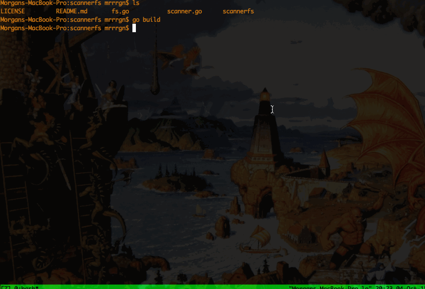

Scanner FS
==========

Scanner FS is a FUSE filesystem that enumerates all of the hosts on a network device and displays them as readble files. Reading a file
will then trigger an nmap scan. In the future each host will instead be a directory, with a variety of scans available (nessus, nmap -o, etc...)
as readable files.

####USAGE:
    go get
    go build
    ./scannerfs en0 mnt
    ls mnt
    > 192.168.1.5
    cat mnt/192.168.1.5
    >
    Starting Nmap 6.47 ( http://nmap.org ) at 2015-10-04 20:23 PDT
    Nmap scan report for 192.168.1.5
    Host is up (0.75s latency).
    Not shown: 995 closed ports
    PORT     STATE SERVICE
    80/tcp   open  http
    443/tcp  open  https
    1026/tcp open  LSA-or-nterm
    1900/tcp open  upnp
    8080/tcp open  http-proxy

</img>
